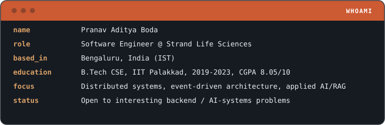
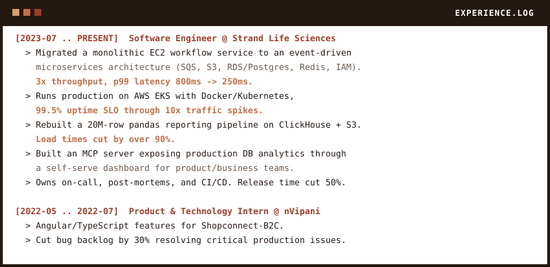

# Pranav Aditya Boda

**Software Engineer @ Strand** &nbsp;|&nbsp; **Backend & Distributed Systems** &nbsp;|&nbsp; **IIT Palakkad CSE**

[LinkedIn](https://www.linkedin.com/in/pranavadityaboda/) &nbsp;·&nbsp; [Email](mailto:pranavadityaboda@gmail.com)

 

## Whoami

 

## Stack

 

## Experience

 

## Projects

Python, FastAPI, LangChain, Chroma, RAG, Streamlit

Clones any GitHub repo, chunks it via tree-sitter AST parsing, and generates API references, READMEs and beginner guides through a RAG pipeline grounded in the real codebase. Cuts documentation turnaround from days to minutes.

[Live Demo &rarr;](https://codelensfrontend-production.up.railway.app/)

C++, Python, Intel IPP-Crypto, SageMath

Applies finite field arithmetic and number theory to evaluate permutation polynomials as VDFs, a cryptographic primitive for trustless randomness. Demonstrates a 4x speed improvement over SageMath baselines using Intel IPP-Crypto.
