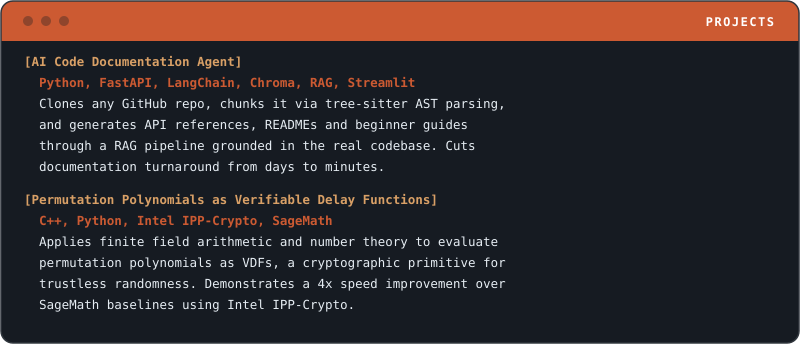

# Pranav Aditya Boda

**Software Engineer @ Strand** &nbsp;|&nbsp; **Backend & Distributed Systems** &nbsp;|&nbsp; **IIT Palakkad CSE**

[LinkedIn](https://www.linkedin.com/in/pranavadityaboda/) &nbsp;·&nbsp; [Email](mailto:pranavadityaboda@gmail.com) &nbsp;·&nbsp; [GitHub](https://github.com/PranavAdityaBoda)

 

## Whoami

 

## Stack

 

## Experience

 

## Projects

[AI Code Documentation Agent (repo)](https://github.com/PranavAdityaBoda/RAG_CodeAssistant) &nbsp;·&nbsp; [Live Demo](https://codelensfrontend-production.up.railway.app/) &nbsp;&nbsp;|&nbsp;&nbsp; [Verifiable Delay Functions (repo)](https://github.com/PranavAdityaBoda-7/BTP)
